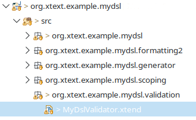

# Validation

## Term
Validation is the process of checking the value of something. In terms of Software Engineering, it refers to the process of checking, if the realisation is useful for the given purpose.

## Validating an Xtext DSL
In many applications (e.g. the Xtext User Guide), validation and verification are not distinguished. In this case, verification is treated in [Verification.md](Verification.md).

Xtext offers the following validation method:

1. Semantic Validation

## Semantic Validation
A DSL consists of the following three components:

1. Abstract Syntax
2. Concrete Syntax
3. Semantics

The first and second part are covered by syntax. The third component needs to be checked seperatly, since it is not part of the grammar.

To add semantical support, Xtext offers the `validation` package. By default, this package lays within the same subproject, as the grammar.

Xtext automatically creates a file `MyDslValidator.xtend`, which is responsible for semantical validation. By default, it looks like this:

    package org.xtext.example.mydsl.validation

    import org.eclipse.xtext.validation.Check

    class MyDslValidator extends AbstractMyDslValidator {

    }

The language engineer can now fill this with the desired validation rules. It is done by creating a method within the Validator, which is annotated with `@Check`. 

Thinking of the newsfeed language ([NewsFeedLanguage.md](NewsFeedLanguage.md)), a rule for checking if at least two articles are present, could look like this (Xtend):

    @Check
    def checkNumberOfArticles(Feed feed) {
        if (feed.articles.size < 2) {
            warning('There should be at least two articles!, 
                MyDslPackage.Literals.FEED__ARTICLES, 'invalidName')
        }
    }

To give feedback to the user, e.g. giving warnings, the abstract class `AbstractInjectableValidator` (which `AbstractMyDslValidator` inherits from) provides three different methods:

- info(String message, EStructuralFeature feature)
- warning(String message, EStructuralFeature feature)
- error(String message, EStructuralFeature feature)

For further documentation on these three methods, see the [Xtext documentation](https://archive.eclipse.org/modeling/tmf/xtext/javadoc/2.9/org/eclipse/xtext/validation/AbstractInjectableValidator.html).